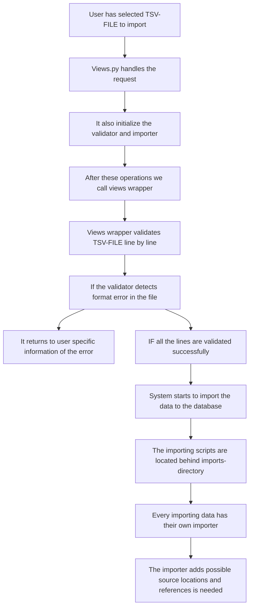

# Imports documentation

### Abstract

The Import Tool is a feature designed to streamline the process of importing data from .tsv files into the system's database. It offers a user-friendly interface where users can upload their .tsv files via a web form. Upon submission, the system performs a series of validations to ensure the integrity and correctness of the provided data. If the validation process succeeds without any errors, the data is imported into the database, and a success message is returned to the user on the web page.

## Usage

Users can upload their .tsv files using the provided web form. The system checks the validity of the uploaded .tsv file to ensure that it meets the required format and data integrity standards.
If the validation process completes successfully, the system proceeds to import the data from the .tsv file into the database.
Upon successful import, a confirmation message is displayed to the user on the web page, indicating that the import process has been completed successfully.

## Data Validation

Validation are done by using 'laravel' method. Laravel method origins from php.

For each importer, one creates file. e.g "occurrence_validation.py". where you construct rules for each wanted field in data dictionary.

Example: 

Data dictionary includes all fields the datatable.
Data rules include all fields that needs to be validated.

Base validation file includes subfunction that can be used in rules fields.

Currently it includes:

- boolean: Validates if the field contains a boolean value.
- author: Validates if the field contains author-related information.
- required: Validates if the field is required and must not be empty.
- ChoiceValue: Validates if the field contains values from specific table
- in: Validates if the field value is within a specified range or set. 
- alpha: Validates if the field contains alphabetic characters only.
- in_db: Validates if the field value exists in a specified database.
- digits: Validates if the field contains digit characters only.
- coordinateSystem: Validates if the field contains coordinate system-related information. Field must include following fields in the current order separated by ',' : 	verbatimLatitude,verbatimLongitude,verbatimCoordinates
- max: Validates if the field value is less than or equal to a specified maximum.
- min: Validates if the field value is greater than or equal to a specified minimum.
- regex: Validates if the field value matches a specified regular expression pattern.

Rules that require values. e.g min can be written min:20 meaning minium value is 20.

## Architecture

The files that handels Import Tools are located behind _app/imports_-directory. The directory contains for example the validation-library that handels data validation. Top level description for Import Tool is describe below:

### More accureated description of Import Tool

The import feature assumes that the data has been fully validated before importing. When using Mammalbase, validation actually occurs before exporting data to the database.

Each importer inherits from the so-called base importer (base_importer.py). BaseImporter contains methods needed for importing various types of data into the database. These methods, for example, make necessary references to existing database entries or create new ones if needed. The elements to be created are usually such that they cannot be directly imported as they are from the tsv file. Therefore, the structure of the database is not nearly identical to the structure of the tsv file. 

Each importer (Occurrences, ETS, etc.) adds one line from the tsv file to the database. After a successful addition, the value True is returned (False in case of failure), and the line is added to the database. First, models are created for those entries that cannot be directly added from the tsv file (such as SourceLocation and SourceHabitat, etc.). Finally, the created reference models and strings are added to the database using Django's get_or_create method.
