# Imports documentation

### Abstract

The Import Tool is a feature designed to streamline the process of importing data from .tsv files into the system's database. It offers a user-friendly interface where users can upload their .tsv files via a web form. Upon submission, the system performs a series of validations to ensure the integrity and correctness of the provided data. If the validation process succeeds without any errors, the data is imported into the database, and a success message is returned to the user on the web page.

## Usage

Users can upload their .tsv files using the provided web form. The system checks the validity of the uploaded .tsv file to ensure that it meets the required format and data integrity standards.
If the validation process completes successfully, the system proceeds to import the data from the .tsv file into the database.
Upon successful import, a confirmation message is displayed to the user on the web page, indicating that the import process has been completed successfully.

## Data Validation

TODO:

## Architecture

The files that handels Import Tools are located behind _app/imports_-directory. The directory contains for example the validation-library that handels data validation. Top level description for Import Tool is describe below:

```mermaid
graph TD;
    User&nbsp;has&nbsp;selected&nbsp;TSV-FILE&nbsp;to&nbsp;import --> Views.py&nbsp;handles&nbsp;the&nbsp;request;
    Views.py&nbsp;handles&nbsp;the&nbsp;request --> It&nbsp;also&nbsp;initialize&nbsp;the&nbsp;validator&nbsp;and&nbsp;importer;
    It&nbsp;also&nbsp;initialize&nbsp;the&nbsp;validator&nbsp;and&nbsp;importer --> After&nbsp;these&nbsp;operations&nbsp;we&nbsp;call&nbsp;views&nbsp;wrapper;
    After&nbsp;these&nbsp;operations&nbsp;we&nbsp;call&nbsp;views&nbsp;wrapper --> Views&nbsp;wrapper&nbsp;validates&nbsp;TSV-FILE&nbsp;line&nbsp;by&nbsp;line;
    Views&nbsp;wrapper&nbsp;validates&nbsp;TSV-FILE&nbsp;line&nbsp;by&nbsp;line --> If&nbsp;the&nbsp;validator&nbsp;detects&nbsp;format&nbsp;error&nbsp;in&nbsp;the&nbsp;file;
    If&nbsp;the&nbsp;validator&nbsp;detects&nbsp;format&nbsp;error&nbsp;in&nbsp;the&nbsp;file --> It&nbsp;returns&nbsp;to&nbsp;user&nbsp;specific&nbsp;information&nbsp;of&nbsp;the&nbsp;error;
    If&nbsp;the&nbsp;validator&nbsp;detects&nbsp;format&nbsp;error&nbsp;in&nbsp;the&nbsp;file --> IF&nbsp;all&nbsp;the&nbsp;lines&nbsp;are&nbsp;validated&nbsp;successfully;
    IF&nbsp;all&nbsp;the&nbsp;lines&nbsp;are&nbsp;validated&nbsp;successfully --> System&nbsp;starts&nbsp;to&nbsp;import&nbsp;the&nbsp;data&nbsp;to&nbsp;the&nbsp;database;
    System&nbsp;starts&nbsp;to&nbsp;import&nbsp;the&nbsp;data&nbsp;to&nbsp;the&nbsp;database --> The&nbsp;importing&nbsp;scripts&nbsp;are&nbsp;located&nbsp;behind&nbsp;imports-directory;
    The&nbsp;importing&nbsp;scripts&nbsp;are&nbsp;located&nbsp;behind&nbsp;imports-directory --> Every&nbsp;importing&nbsp;data&nbsp;has&nbsp;their&nbsp;own&nbsp;importer;
    Every&nbsp;importing&nbsp;data&nbsp;has&nbsp;their&nbsp;own&nbsp;importer --> The&nbsp;importer&nbsp;adds&nbsp;possible&nbsp;source&nbsp;locations&nbsp;and&nbsp;references&nbsp;is&nbsp;needed;




```

