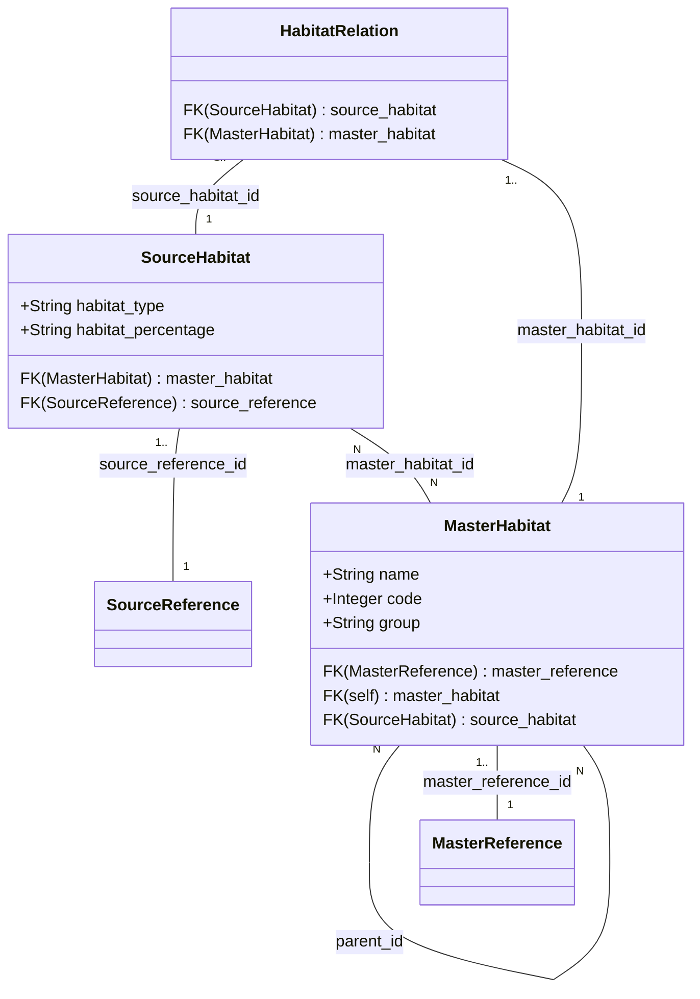

```mermaid
classDiagram
    class SourceHabitat {
        FK(MasterHabitat) master_habitat
        FK(SourceReference) source_reference
        +String habitat_type
        +String habitat_percentage
    }
    class MasterHabitat {
        FK(MasterReference) master_reference
        FK(self) master_habitat
        FK(SourceHabitat) source_habitat
        +String name
        +Integer code
        +String group
    }
    class HabitatRelation {
        FK(SourceHabitat) source_habitat
        FK(MasterHabitat) master_habitat
    }
    class SourceReference {
    }
    class MasterReference {
    }

    SourceHabitat "1.." -- "1" SourceReference : source_reference_id
    SourceHabitat "N" -- "N" MasterHabitat : master_habitat_id
    MasterHabitat "N" -- "N" MasterHabitat : parent_id
    MasterHabitat "1.." -- "1" MasterReference : master_reference_id
    HabitatRelation "1.." -- "1" SourceHabitat : source_habitat_id
    HabitatRelation "1.." -- "1" MasterHabitat : master_habitat_id


```