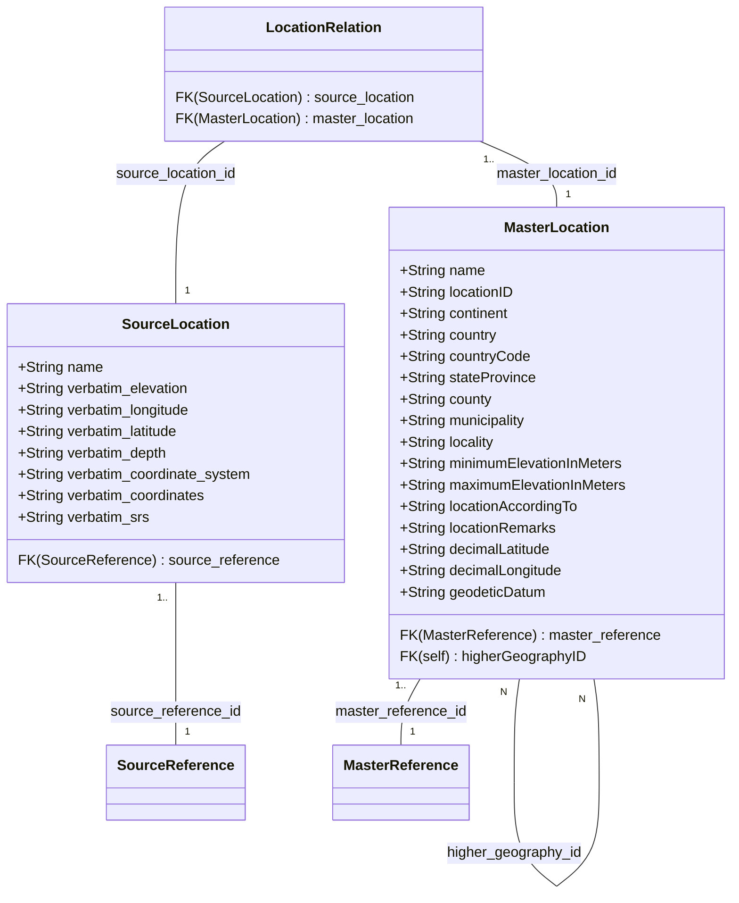

```mermaid
classDiagram
    class SourceLocation {
        FK(SourceReference) source_reference
        +String name
        +String verbatim_elevation
        +String verbatim_longitude
        +String verbatim_latitude
        +String verbatim_depth
        +String verbatim_coordinate_system
        +String verbatim_coordinates
        +String verbatim_srs

    }
    class MasterLocation {
        FK(MasterReference) master_reference
        FK(self) higherGeographyID
        +String name
        +String locationID
        +String continent
        +String country
        +String countryCode
        +String stateProvince
        +String county
        +String municipality
        +String locality
        +String minimumElevationInMeters
        +String maximumElevationInMeters
        +String locationAccordingTo
        +String locationRemarks
        +String decimalLatitude
        +String decimalLongitude
        +String geodeticDatum
    }
    class LocationRelation {
        FK(SourceLocation) source_location
        FK(MasterLocation) master_location
    }
    class SourceReference {
    }
    class MasterReference {
    }

    SourceLocation "1.." -- "1" SourceReference : source_reference_id
    MasterLocation "N" -- "N" MasterLocation : higher_geography_id
    MasterLocation "1.." -- "1" MasterReference : master_reference_id
    LocationRelation "1.." -- "1" SourceLocation : source_location_id
    LocationRelation "1.." -- "1" MasterLocation : master_location_id


```