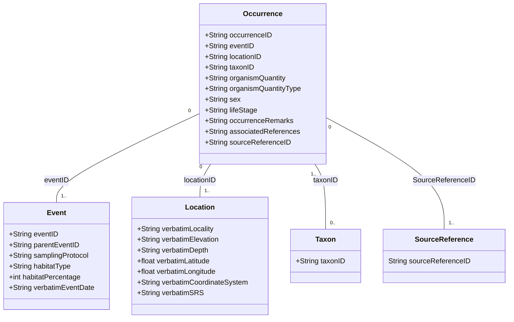

```mermaid
classDiagram
    class Occurrence {
		+String occurrenceID
		+String eventID
		+String locationID
		+String taxonID
		+String organismQuantity
		+String organismQuantityType
		+String sex
		+String lifeStage
		+String occurrenceRemarks
		+String associatedReferences
		+String sourceReferenceID
    }
    class Event {
		+String eventID
		+String parentEventID
		+String samplingProtocol
		+String habitatType
		+int habitatPercentage
		+String verbatimEventDate
    }
    class Location {
      	+String verbatimLocality
		+String verbatimElevation
		+String verbatimDepth
		+float verbatimLatitude
		+float verbatimLongitude
		+String verbatimCoordinateSystem
		+String verbatimSRS
    }
    class Taxon {
      	+String taxonID
    }
	class SourceReference {
		String sourceReferenceID
	}

    Occurrence "0" -- "1.." Event : eventID
    Occurrence "0" -- "1.." Location : locationID
    Occurrence "1.." -- "0.." Taxon : taxonID
	Occurrence "0" -- "1.." SourceReference : SourceReferenceID
```
