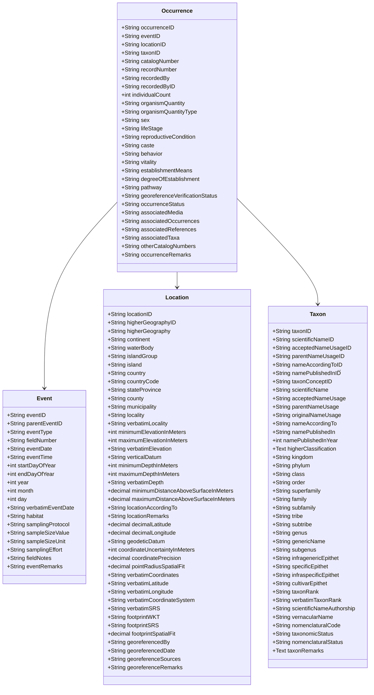

```mermaid
classDiagram
	Occurrence -->Event
	Occurrence -->Location
	Occurrence -->Taxon
	
	
	class Occurrence {
		+String occurrenceID
		+String eventID
		+String locationID
		+String taxonID
		
		+String catalogNumber
		+String recordNumber
		+String recordedBy
		+String recordedByID
		+int individualCount
		+String organismQuantity
		+String organismQuantityType
		+String sex
		+String lifeStage
		+String reproductiveCondition
		+String caste
		+String behavior
		+String vitality
		+String establishmentMeans
		+String degreeOfEstablishment
		+String pathway
		+String georeferenceVerificationStatus
		+String occurrenceStatus
		+String associatedMedia
		+String associatedOccurrences
		+String associatedReferences
		+String associatedTaxa
		+String otherCatalogNumbers
		+String occurrenceRemarks
	}
	
	class Event {
		+String eventID
		+String parentEventID
		
		+String eventType
		+String fieldNumber
		+String eventDate
		+String eventTime
		+int startDayOfYear
		+int endDayOfYear
		+int year
		+int month
		+int day
		+String verbatimEventDate
		+String habitat
		+String samplingProtocol
		+String sampleSizeValue
		+String sampleSizeUnit
		+String samplingEffort
		+String fieldNotes
		+String eventRemarks
	}
	
	class Location {
		+String locationID
		+String higherGeographyID
		+String higherGeography
		+String continent
		+String waterBody
		+String islandGroup
		+String island
		+String country
		+String countryCode
		+String stateProvince
		+String county
		+String municipality
		+String locality
		+String verbatimLocality
		+int minimumElevationInMeters
		+int maximumElevationInMeters
		+String verbatimElevation
		+String verticalDatum
		+int minimumDepthInMeters
		+int maximumDepthInMeters
		+String verbatimDepth
		+decimal minimumDistanceAboveSurfaceInMeters
		+decimal maximumDistanceAboveSurfaceInMeters
		+String locationAccordingTo
		+String locationRemarks
		+decimal decimalLatitude
		+decimal decimalLongitude
		+String geodeticDatum
		+int coordinateUncertaintyInMeters
		+decimal coordinatePrecision
		+decimal pointRadiusSpatialFit
		+String verbatimCoordinates
		+String verbatimLatitude
		+String verbatimLongitude
		+String verbatimCoordinateSystem
		+String verbatimSRS
		+String footprintWKT
		+String footprintSRS
		+decimal footprintSpatialFit
		+String georeferencedBy
		+String georeferencedDate
		+String georeferenceSources
		+String georeferenceRemarks
	}
	
	class Taxon {
		+String taxonID
		+String scientificNameID
		+String acceptedNameUsageID
		+String parentNameUsageID
		+String nameAccordingToID
		+String namePublishedInID̈́
		+String taxonConceptID
		+String scientificName
		+String acceptedNameUsage
		+String parentNameUsage
		+String originalNameUsage
		+String nameAccordingTo
		+String namePublishedIn
		+int namePublishedInYear
		+Text higherClassification
		+String kingdom
		+String phylum
		+String class
		+String order
		+String superfamily
		+String family
		+String subfamily
		+String tribe
		+String subtribe
		+String genus
		+String genericName
		+String subgenus
		+String infragenericEpithet
		+String specificEpithet
		+String infraspecificEpithet
		+String cultivarEpithet
		+String taxonRank
		+String verbatimTaxonRank
		+String scientificNameAuthorship
		+String vernacularName
		+String nomenclaturalCode
		+String taxonomicStatus
		+String nomenclaturalStatus
		+Text taxonRemarks
	}
```