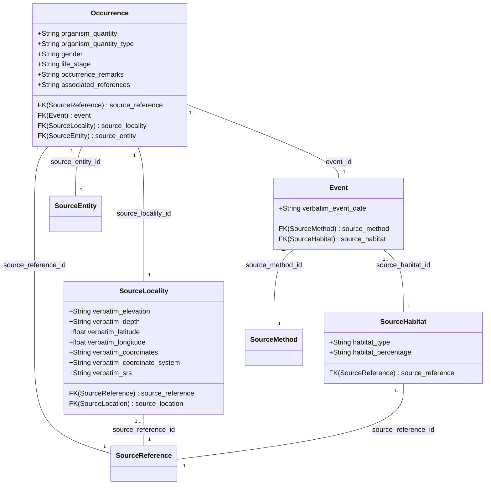

```mermaid
classDiagram
    class Occurrence {
        FK(SourceReference) source_reference
        FK(Event) event
        FK(SourceLocality) source_locality
        FK(SourceEntity) source_entity
        +String organism_quantity
        +String organism_quantity_type
        +String gender
        +String life_stage
        +String occurrence_remarks
        +String associated_references
    }
    class Event {
        FK(SourceMethod) source_method
        FK(SourceHabitat) source_habitat
        +String verbatim_event_date
    }
    class SourceLocality {
        FK(SourceReference) source_reference
        FK(SourceLocation) source_location
        +String verbatim_elevation
        +String verbatim_depth
        +float verbatim_latitude
        +float verbatim_longitude
        +String verbatim_coordinates
        +String verbatim_coordinate_system
        +String verbatim_srs
    }
    class SourceHabitat {
        FK(SourceReference) source_reference
        +String habitat_type
        +String habitat_percentage
    }
    class SourceEntity {
    }
    class SourceReference {
    }
    class SourceMethod {

    }

    Occurrence "1.." -- "1" Event : event_id
    Occurrence "1" -- "1" SourceLocality : source_locality_id
    Occurrence "1.." -- "1" SourceEntity : source_entity_id
    Occurrence "1.." -- "1" SourceReference : source_reference_id
    Event "1.." -- "1" SourceHabitat : source_habitat_id
    Event "1.." -- "1" SourceMethod : source_method_id
    SourceLocality "1.." -- "1" SourceReference : source_reference_id
    SourceHabitat "1.." -- "1" SourceReference : source_reference_id


```